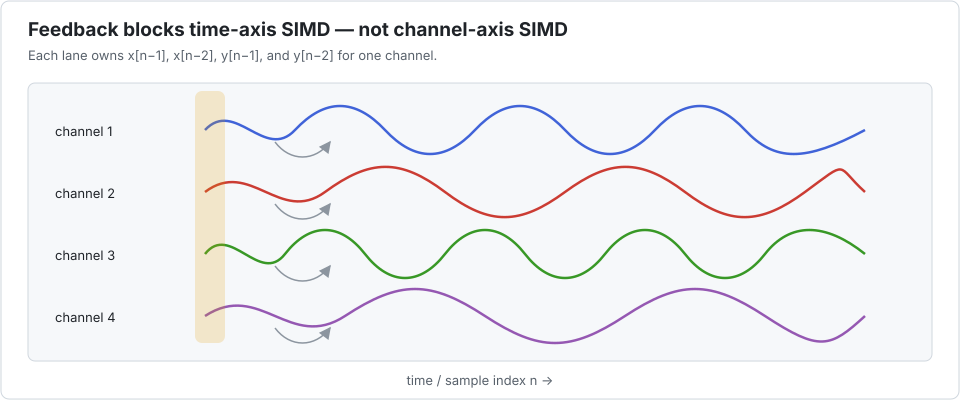

# IIR biquad filter bank

A direct-form-I biquad has four pieces of history. For each channel,

```math
y_n=b_0x_n+b_1x_{n-1}+b_2x_{n-2}-a_1y_{n-1}-a_2y_{n-2}.
```

The feedback terms make time sequential. A bank of independent channels, however, has
exactly the population parallelism Interleave needs.



## Hear it

```@raw html
<!-- ATTENTION au chemin : Documenter NE RÉÉCRIT PAS les liens dans un bloc `@raw html`, et
     `prettyurls` (actif en CI, donc sur le site publié) rend cette page à
     applications/<nom>/index.html, soit un niveau plus profond qu'en local. Le `../../` ci-
     dessous est donc correct EN PRODUCTION et cassé dans un `make.jl` lancé sans CI=true.
     Pour prévisualiser les médias en local : CI=true julia --project=docs docs/make.jl -->
<div class="interleave-media">
  <audio controls preload="none" style="width: 100%;">
    <source src="../../assets/media/biquad_demo.mp3" type="audio/mpeg">
    Your browser does not support the audio element.
  </audio>
  <p class="interleave-caption">
    0–3 s: a raw sawtooth Am7 chord. 3–6 s: the same chord through a 600 Hz low-pass biquad.
  </p>
</div>
```

This is not an illustration of the algorithm — it **is** the algorithm. The 64 partials of the
chord are the 64 channels of the batch, they go through `apply!(biquad!, …)` together, and what
you hear is their sum. The generator asserts that the packed result is bit-exact against the
scalar reference before it writes a single sample, so a demo that sounded right while the
kernel was wrong could not be produced.

Regenerate it with:

```bash
julia --project=docs docs/media/make_biquad_demo.jl
ffmpeg -f s16le -ar 44100 -ac 1 -i docs/media/biquad_demo.pcm -b:a 96k out.mp3
```

The script prints the measured band response — `-0.0 dB` at 200 Hz, `-2.8 dB` at the 600 Hz
cutoff, `-15.9 dB` at 1500 Hz, `-29.3 dB` at 3 kHz — which is the textbook second-order
Butterworth curve.

The moving packet in the animation is a sample index, not a time window: every lane owns the
complete state of one channel, so channels never contaminate each other.

## The benchmark

`bench/biquad.jl` processes 4,096 channels of 1,024 samples with fixed `Float32`
coefficients. The estimate is five multiplies and four additions per sample.

| configuration | time | estimated GFlop/s | speedup vs scalar | LLVM SIMD |
|---|---:|---:|---:|:---:|
| scalar reference | 12.95 ms | 2.9 | 1.00× | — |
| `P=1` | 12.82 ms | 2.9 | 1.01× | — |
| `P=2` | 6.43 ms | 5.9 | 2.01× | yes |
| `P=4` | 3.18 ms | 11.9 | 4.07× | yes |
| `P=8` | 1.61 ms | 23.4 | 8.03× | yes |
| `P=16` | 0.85 ms | 44.3 | **15.19×** | yes |
| `P=32` | 1.07 ms | 35.1 | 12.05× | yes |

The nearly proportional scaling through `P=16` is the signature of a latency-bound
recurrence. `P=32` then regresses: wider is a candidate to measure, not a monotonic promise.
`P=1` also validates that the driver and views do not impose a material cost on the scalar
path.

### With explicit task parallelism

| configuration | time | estimated GFlop/s | speedup vs scalar | speedup vs threaded `P=1` |
|---|---:|---:|---:|---:|
| `P=1`, 10 threads | 2.02 ms | 18.7 | 6.41× | 1.00× |
| `P=2`, 10 threads | 1.13 ms | 33.4 | 11.46× | 1.79× |
| `P=4`, 10 threads | 0.61 ms | 61.6 | 21.14× | 3.30× |
| `P=8`, 10 threads | 0.41 ms | 91.8 | 31.49× | 4.91× |
| `P=16`, 10 threads | 0.34 ms | 110.8 | **38.00×** | **5.93×** |
| `P=32`, 10 threads | 0.55 ms | 69.2 | 23.72× | 3.70× |

The plateau from `P=8` to `P=16` after threading says that another resource—memory traffic,
core scheduling, or instruction throughput—has replaced the original recurrence bottleneck.

## Competing approaches

- [`DSP.jl`](https://docs.juliadsp.org/stable/filters/) should be the first choice when the
  problem is standard filter design and application. It provides biquad and second-order
  section representations, stateful filters, in-place APIs, and column-wise filtering.
- Ordinary task parallelism across channels is simple and complementary. It is often enough
  for a small number of long channels; Interleave adds fine-grained SIMD when the channel bank
  is wide enough.
- Hand-written explicit SIMD can put one channel in each vector lane, but the state variables,
  loads, stores, and tail handling become packet-specific source code. Interleave obtains the same
  mapping by changing the element type seen by the existing recurrence.
- A GPU kernel can map channels to threads when signals are already device-resident and the
  batch amortises launch and transfer overhead. Interleave targets the lower-friction CPU case.

Interleave is not a filter-design library and does not compete with DSP.jl's catalogue. Its
claim is narrower: a custom feedback kernel can become cross-channel SIMD without being
rewritten as an explicit vector program.

For the step-by-step version, see [Tutorial 2](../tutorials/biquad.md).
