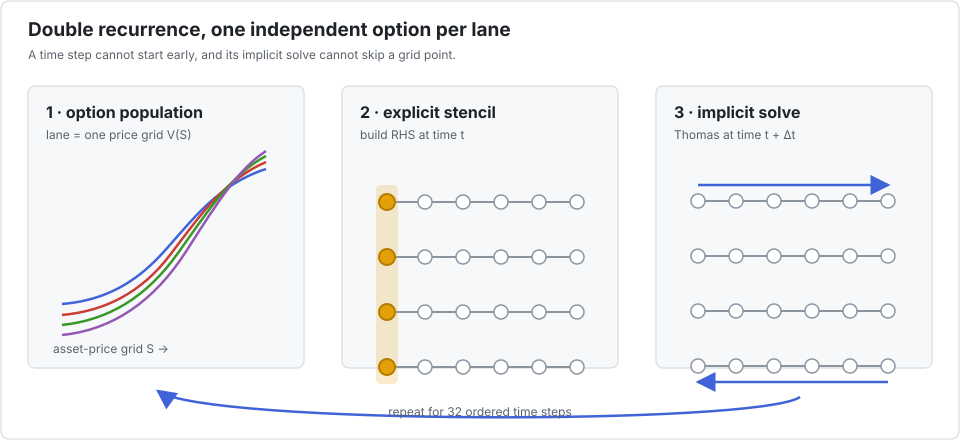

# Black–Scholes with Crank–Nicolson

This benchmark prices a population of options with a one-dimensional finite-difference
scheme. Each time step has two parts: build the explicit tridiagonal right-hand side, then
solve the implicit system with Thomas. The time steps are sequential, and the Thomas sweep
inside each step is sequential too.

Interleave assigns one option grid to each lane. It does not parallelise time or alter the
finite-difference scheme. All lanes execute the same time step and grid point while keeping
their values independent.

## The benchmark

`bench/optionpricing.jl` advances 16,384 option grids, each with 64 points, through 32 time
steps. The coefficient arrays are deliberately per-option, so the example also exercises a
real batched data layout. The estimate is 15 operations per grid point and time step.

| configuration | time | estimated GFlop/s | speedup vs scalar |
|---|---:|---:|---:|
| scalar reference | 273.37 ms | 1.8 | 1.00× |
| `P=1` | 273.39 ms | 1.8 | 1.00× |
| `P=2` | 145.63 ms | 3.5 | 1.88× |
| `P=4` | 73.34 ms | 6.9 | 3.73× |
| `P=8` | 40.11 ms | 12.5 | 6.82× |
| `P=16` | 23.16 ms | 21.7 | 11.80× |
| `P=32` | 15.61 ms | 32.2 | **17.51×** |

The improvement is slightly less than proportional to `P`, but the repeated use of each
option grid gives DLI enough arithmetic to amortise the packed representation.

### With explicit task parallelism

| configuration | time | estimated GFlop/s | speedup vs scalar | speedup vs threaded `P=1` |
|---|---:|---:|---:|---:|
| `P=1`, 10 threads | 36.06 ms | 14.0 | 7.58× | 1.00× |
| `P=2`, 10 threads | 19.70 ms | 25.6 | 13.88× | 1.83× |
| `P=4`, 10 threads | 10.67 ms | 47.2 | 25.62× | 3.38× |
| `P=8`, 10 threads | 6.41 ms | 78.6 | 42.66× | 5.63× |
| `P=16`, 10 threads | 4.07 ms | 123.8 | 67.24× | 8.87× |
| `P=32`, 10 threads | 2.85 ms | 176.7 | **95.95×** | **12.66×** |

This is the suite's strongest threaded case. The 32 time steps repeatedly reuse a small
grid, so the computation is more cache-friendly and compute-bound than the one-pass Thomas
benchmark. The 95.95× figure is still one local end-to-end measurement, not a multiplication
of independent 10-thread and 32-lane factors.

## Competing approaches

- For a vanilla European option under the exact Black–Scholes assumptions, the closed-form
  formula removes the PDE entirely and should win. A finite-difference solver is justified
  by contracts, boundaries, coefficients, or exercise features that require it.
- [`MethodOfLines.jl`](https://docs.sciml.ai/MethodOfLines/dev/) automates finite-difference
  discretisation of symbolic PDEs and connects to the SciML solver ecosystem. Prefer that
  route for modelling flexibility and solver composition; prefer Interleave when a compact,
  fixed CPU kernel and its exact execution order are central.
- A GPU can expose both option-level and grid-level parallelism. CUDA.jl supports high-level
  array operations and custom Julia kernels; cuSPARSE supplies batched tridiagonal solves.
  This is compelling for device-resident portfolios large enough to amortise transfers and
  launches.
- Replacing Thomas with cyclic reduction or PCR exposes parallelism within each grid, but it
  changes work, storage, and floating-point order. Interleave instead keeps the numerical kernel
  unchanged and exploits independence between options.

The application is therefore a good Interleave target only after the modelling choice has been
made: DLI optimises a chosen recurrence; it does not decide whether the recurrence is the
right pricing method.
