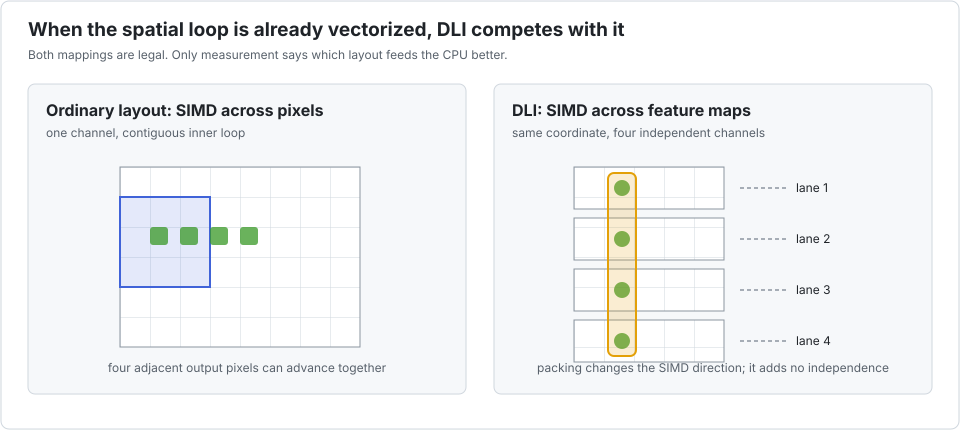

# Depthwise 3×3 convolution

Depthwise convolution applies one spatial filter per channel. Different output pixels are
independent once the input is fixed, so the ordinary contiguous inner loop is already an
excellent SIMD target.

This benchmark is intentionally adversarial to Interleave. The left side of the animation is
what LLVM sees in the reference: adjacent output pixels can advance together. DLI chooses
the same coordinate in several channels instead. That mapping is legal, but it replaces an
already successful SIMD direction rather than unlocking a blocked one.

## The benchmark

`bench/depthwise.jl` applies one 3×3 `Float32` stencil to 512 independent 64×64 feature
maps. The estimate is nine multiplies and eight additions for every interior pixel.

| configuration | time | estimated GFlop/s | speedup vs scalar | LLVM SIMD |
|---|---:|---:|---:|:---:|
| scalar reference | 0.81 ms | 41.1 | 1.00× | compiler-controlled |
| `P=1` | 0.79 ms | 42.5 | **1.03×** | compiler-controlled |
| `P=2` | 4.75 ms | 7.0 | 0.17× | yes, across channels |
| `P=4` | 3.02 ms | 11.1 | 0.27× | yes, across channels |
| `P=8` | 2.49 ms | 13.4 | 0.33× | yes, across channels |
| `P=16` | 1.94 ms | 17.2 | 0.42× | yes, across channels |
| `P=32` | 1.61 ms | 20.8 | 0.51× | yes, across channels |

The presence of vector instructions at `P>1` is not evidence of a good transformation.
Even `P=32`, the least slow packed case, takes about twice the reference time. `P=1` is deliberately the
scalar type `Float32`, not `Vec{1,Float32}`, so LLVM recovers its normal spatial strategy and
performance returns to parity.

### With explicit task parallelism

| configuration | time | estimated GFlop/s | speedup vs scalar | speedup vs threaded `P=1` |
|---|---:|---:|---:|---:|
| `P=1`, 10 threads | 0.39 ms | 85.7 | **2.08×** | 1.00× |
| `P=2`, 10 threads | 1.02 ms | 32.9 | 0.80× | 0.38× |
| `P=4`, 10 threads | 0.69 ms | 48.2 | 1.17× | 0.56× |
| `P=8`, 10 threads | 0.56 ms | 60.2 | 1.46× | 0.70× |
| `P=16`, 10 threads | 0.50 ms | 66.6 | 1.62× | 0.78× |
| `P=32`, 10 threads | 0.40 ms | 83.7 | 2.04× | 0.98× |

Threading helps because channels are independent, but the best result keeps `P=1`. Comparing
only `P=32` threaded with the serial reference would misleadingly attribute a 2.04× result to
DLI; compared with threaded `P=1`, the packed layout is still slightly slower.

## Competing approaches

- Plain Julia and LLVM are already the relevant competitor. `@simd` may help only when its
  independence promise is valid and aliasing is understood; it should never be added by habit.
- [`LoopVectorization.@turbo`](https://juliasimd.github.io/LoopVectorization.jl/stable/api/)
  models and reorders independent loop nests. [`Tullio.jl`](https://github.com/mcabbott/Tullio.jl)
  can express convolutions and stencils in index notation and can combine loop transformation,
  tiling, and threading. Both attack the spatial loop—the right axis for this workload.
- [`NNlib.depthwiseconv`](https://fluxml.ai/Flux.jl/stable/reference/models/nnlib/#NNlib.depthwiseconv)
  is the production-oriented choice in a neural-network pipeline. NNlib also has CUDA and
  AMDGPU extensions and ChainRules support.
- Hand-written explicit SIMD offers control but is unnecessary unless inspection proves that
  the compiler missed the regular spatial loop.

The lesson is a feature, not an embarrassment: one kernel can remain in the Interleave workflow
while `P=1` opts out of DLI. This control case prevents the project from claiming speedups
against an artificially scalar reference.
