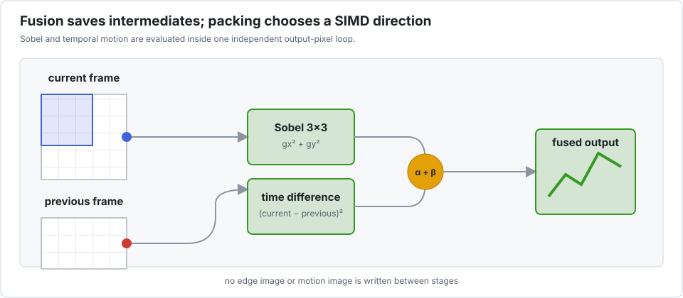

# Fused Sobel and motion detection

This kernel combines a 3×3 Sobel edge response from the current frame with the squared
difference between current and previous frames. Fusion avoids writing two intermediate
images.

Each output pixel depends on a neighbourhood of input pixels, but output pixels do not depend
on earlier output pixels. Like depthwise convolution, the contiguous spatial loop is open to
ordinary compiler vectorization. The benchmark tests whether packing independent streams is
still worthwhile.

## The benchmark

`bench/video.jl` processes 256 independent pairs of 128×128 frames. Its operation estimate
is 23 floating-point operations per interior output pixel.

| configuration | time | estimated GFlop/s | speedup vs scalar |
|---|---:|---:|---:|
| scalar reference | 2.17 ms | 43.1 | 1.00× |
| `P=1` | 2.19 ms | 42.7 | **0.99×** |
| `P=2` | 5.04 ms | 18.5 | 0.43× |
| `P=4` | 2.49 ms | 37.5 | 0.87× |
| `P=8` | 2.48 ms | 37.7 | 0.88× |
| `P=16` | 2.43 ms | 38.4 | 0.89× |
| `P=32` | 2.35 ms | 39.7 | 0.92× |

No sequential packed configuration beats the ordinary layout. Fusion is valuable, but DLI
is not what creates that value.

### With explicit task parallelism

| configuration | time | estimated GFlop/s | speedup vs scalar | speedup vs threaded `P=1` |
|---|---:|---:|---:|---:|
| `P=1`, 10 threads | 0.64 ms | 145.8 | 3.38× | 1.00× |
| `P=2`, 10 threads | 1.15 ms | 81.2 | 1.88× | 0.56× |
| `P=4`, 10 threads | 0.63 ms | 149.4 | 3.46× | 1.03× |
| `P=8`, 10 threads | 0.67 ms | 139.8 | 3.24× | 0.96× |
| `P=16`, 10 threads | 0.52 ms | 178.8 | 4.15× | 1.23× |
| `P=32`, 10 threads | 0.50 ms | 186.5 | **4.32×** | **1.28×** |

In this particular run `P=32` became fastest only after threading, by 28% over threaded
`P=1`. That is much smaller—and more sensitive to cache, scheduling, and machine load—than
the 4.32× comparison with a serial reference suggests. The defensible default remains
`P=1`; retune the combined threaded configuration for the target stream count and frame size.

## Competing approaches

- Plain Julia/LLVM is already effective for the spatial loop. Keeping a fused loop and a
  normal array is the lowest-complexity baseline.
- LoopVectorization can target the independent pixel loop, while Tullio is well suited to
  expressing the Sobel stencil in index notation. Their legality assumptions must still be
  checked when output aliases an input.
- Image-processing or neural-network libraries are preferable when their primitive matches
  the full pipeline, especially if they provide optimised CPU and GPU backends. Separate Sobel
  and difference calls may, however, materialise intermediates unless fusion is available.
- A custom [`CUDA.jl`](https://cuda.juliagpu.org/stable/development/kernel/) kernel can map
  pixels and streams to GPU threads and preserve fusion. It is attractive for device-resident
  video, but launch, transfer, and integration costs matter for small CPU-resident frames.
- Threads are a complement rather than a rival to SIMD. Here they provide most of the gain;
  the table isolates the smaller incremental effect of packing.

This case study demonstrates the project's stop rule: a tool that can decline its own
transformation is safer than one that labels every emitted vector instruction a success.
