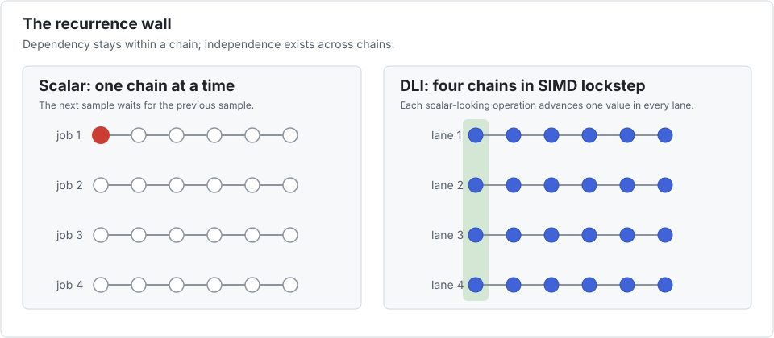
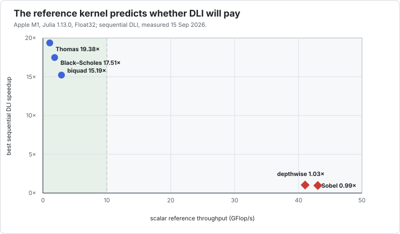
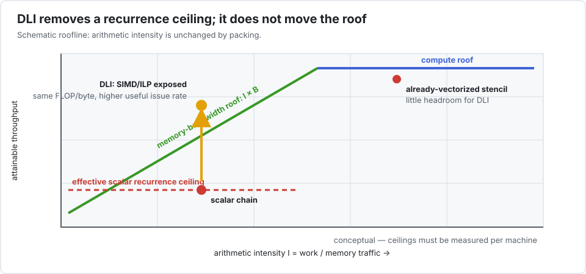
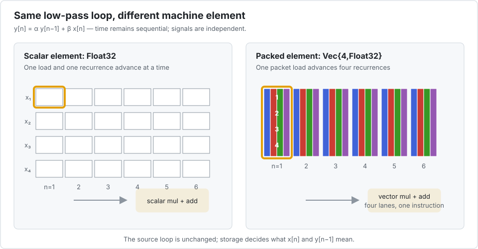
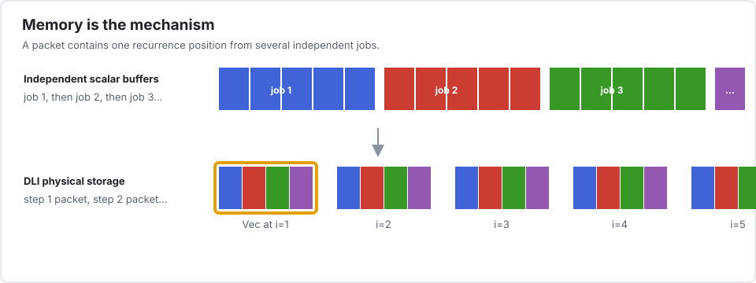

# Interleave.jl

```@raw html
<div class="interleave-hero">
  <h2>Keep the recurrence. Vectorize the population.</h2>
  <p>
    Interleave turns a batch of independent, intrinsically sequential problems into SIMD work.
    You keep one readable kernel; changing the array type changes what one element means
    to the CPU.
  </p>
</div>
```

Many useful algorithms contain a hard dependency:

```math
y_i = f(x_i, y_{i-1}, y_{i-2}, \ldots).
```

The value at ``i`` cannot be computed before ``i-1``. A compiler cannot safely execute
those two iterations together. But if you have hundreds of independent filters, linear
systems, trajectories, or grid lines, there is another axis of parallelism: compute the
same ``i`` for several problems at once.



```@raw html
<p class="interleave-caption">
  Interleave does not break a dependency. It changes the direction in which SIMD is applied.
</p>
```

## Why not use a conventional SoA layout?

That is the natural first alternative, and it exposes the essential trade-off:

| physical layout | pleasant part | price paid |
|---|---|---|
| job-major / AoS | one recurrence is contiguous and reads naturally | values from different jobs are far apart, so SIMD across jobs needs gathers |
| global SoA | all jobs at position `i` are contiguous and an explicit inner job loop can vectorize | the algorithm must be transposed into “time outside, jobs inside”; the formulation needs a batch-sized workspace and keeps one strided stream per array, so it costs 2.2x on a tridiagonal solve and **11.8x** on a pentadiagonal one, where the stream count overwhelms the prefetchers ([measured](manual/what-it-replaces.md)) |
| DLI / blocked SoA | one element is a packet of `P` jobs, while packet `i-1` remains adjacent to packet `i` | `P` becomes a layout choice that must be tuned |

DLI is often called an AoSoA layout: it applies SoA only inside a cache-sized group of
problems. The group advances through the complete recurrence before the next group starts.
This preserves the natural one-problem kernel, gives unit-stride packet loads, and bounds
the distance between consecutive recurrence states. The
[Thomas benchmark](applications/thomas.md) measures the global-SoA rewrite rather than
assuming this argument always wins.

## Is this tool for your kernel?

```@raw html
<div class="interleave-grid">
  <div class="interleave-card">
    <h3>A strong fit</h3>
    <p>You have many independent, similarly shaped problems.</p>
    <p>Each problem contains a recurrence, feedback loop, triangular sweep, or another
       dependency that blocks ordinary loop vectorization.</p>
  </div>
  <div class="interleave-card">
    <h3>Usually the wrong fit</h3>
    <p>Your inner loop is already contiguous and vectorized, problems interact with each
       other, or control flow differs heavily from one problem to the next.</p>
    <p>Use a normal array or choose <code>P = 1</code> instead.</p>
  </div>
</div>
```

The throughput of the ordinary reference is a useful first diagnostic. In the measurements
below, slow scalar references reveal a recurrence bottleneck; already-fast references have
little SIMD work left for Interleave to recover.



The graph reports measurements from one Apple M-series machine, not promises. Always measure
your kernel on your target CPU.

The classical roofline model adds a useful second explanation. Packing does not change
arithmetic intensity: it removes the lower *dependency-latency ceiling* that kept a scalar
recurrence far below both the bandwidth and compute roofs. Once that ceiling is removed,
Thomas eventually becomes bandwidth-bound; a cache-resident biquad can remain limited by
arithmetic latency. Conversely, a stencil already close to a hardware roof has little room
for DLI.



This view follows the [Legolas++ roofline analysis](https://laurentplagne.github.io/Legolas/benchmarks/roofline-model/),
but the points and ceilings must be remeasured for Julia and for each target CPU. A roofline
is an upper bound, not evidence that a particular loop contains SIMD instructions.

## Install the experimental package

Interleave is not registered yet. Install it directly from its repository:

```julia
pkg> add https://github.com/laurentplagne/Interleave.jl
```

## The complete idea in one example

This causal low-pass filter is sequential along `n`:

```@example home
using Interleave

function lowpass!(y, x, α)
    β = one(α) - α
    @inbounds begin
        y[1] = β * x[1]
        for n in 2:length(y)
            y[n] = α * y[n - 1] + β * x[n]
        end
    end
    y
end
```

`@inbounds` is not required for correctness or for using Interleave. It is a lexical promise
made by the kernel author after testing: Julia cannot safely attach it later from `apply!`.
For the Thomas kernel on the measured M1, retaining checks preserved SIMD but was about 30%
slower. During development, remove the annotation; add it only when the index proof is clear.

Write and check it first with ordinary Julia arrays:

```@example home
function make_batch(Arr, nbatch, nsamples)
    x = Arr([Float32(b) + Float32(n) / 32
             for b in 1:nbatch, n in 1:nsamples])
    y = Arr(zeros(Float32, nbatch, nsamples))
    y, x
end

ys, xs = make_batch(Base.Array{Float32,2}, 10, 16)
apply!((y, x) -> lowpass!(y, x, 0.8f0), ys, xs)
ys[1, 1:4]
```

Then change only the storage type:

```@example home
yv, xv = make_batch(Interleave.Array{Float32,2,4}, 10, 16)
apply!((y, x) -> lowpass!(y, x, 0.8f0), yv, xv)

(ys == yv, eltype(parent(yv)), size(parent(yv)))
```

The kernel still sees a one-dimensional array. With the standard batch its elements are
`Float32`; with the interleaved batch they are `Vec{4,Float32}`. Arithmetic on one element
therefore becomes arithmetic on four independent filters.





The logical array remains scalar: `size(yv) == (10, 16)` and `yv[3, 7]` is a `Float32`.
Only `parent(yv)` exposes the packed representation used by the hot kernel.

The comprehension constructor is intentionally convenient, not zero-copy: Julia first
materializes the scalar matrix, then Interleave packs it. When initialization belongs to the
timed path or the batch is very large, allocate with `undef` and fill by broadcast, a loop,
or a device initialization kernel. Measure packing as part of the end-to-end pipeline.

## What is novel here?

Interleave combines four ideas into one programming model:

1. **SIMD follows semantic independence, not necessarily the innermost loop.** The packed
   axis is a population of problems rather than consecutive steps of one problem.
2. **The element type is the optimization switch.** The same source kernel runs on a scalar
   element or a SIMD packet; there is no second “vector implementation” to maintain.
3. **The logical and physical arrays disagree on purpose.** Users read a scalar batch while
   kernels receive dense arrays of packets.
4. **Threading remains explicit.** [`apply!`](@ref) is always sequential;
   [`parallel_apply!`](@ref) is visibly parallel at the call site.

The DLI idea comes from Legolas++, but Julia removes most of its C++ machinery: multiple
dispatch, `AbstractArray`, views, and a concrete SIMD element type are enough.

## Choose a path

```@raw html
<div class="interleave-path">
  <div class="interleave-step"><strong>1 · Solve</strong>Vectorize a tridiagonal recurrence</div>
  <div class="interleave-step"><strong>2 · Stream</strong>Run independent feedback filters</div>
  <div class="interleave-step"><strong>3 · Reorient</strong>Pack the right axis in a 3-D solver</div>
  <div class="interleave-step"><strong>4 · Measure</strong>Decide whether DLI pays and tune P</div>
</div>
```

If this is your first visit, start with [the Thomas tutorial](tutorials/thomas.md). Continue
with the [filter bank](tutorials/biquad.md), [3-D ADI](tutorials/adi.md), and
[performance decision](tutorials/choosing-p.md) tutorials. Together they move from the core
mechanism to realistic layout and tuning decisions.

## Five applications, including the failures

The [`bench/` case studies](applications/index.md) apply the same decision process to every
benchmark shipped with the project:

- recurrence-heavy Thomas, IIR biquad, and Black–Scholes Crank–Nicolson kernels;
- a depthwise convolution and a fused Sobel-motion pipeline that LLVM already vectorizes.

Each study includes an animated explanation, the complete `P` sweep, explicit threaded
results, and a comparison with the most relevant alternatives. The negative cases are part
of the design argument: Interleave provides `P=1` so the same kernel can decline DLI when
ordinary spatial SIMD is better.

See [Positioning and alternatives](manual/alternatives.md) for the wider comparison with
compiler vectorization, LoopVectorization, Tullio, explicit SIMD, task schedulers, domain
libraries, and GPU implementations.
