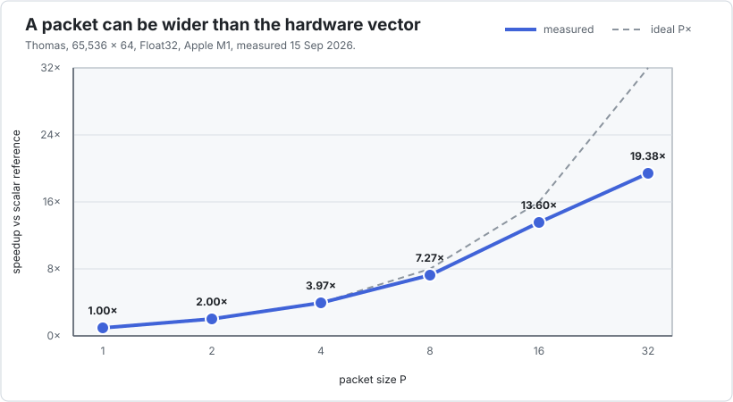

# Performance guide

## Begin with a hypothesis

Interleave should solve a specific performance problem: an important loop is sequential because
of a dependency, and many independent copies of that loop are available. Without both
conditions, DLI is unlikely to help.


The measured examples divide into two regimes:

| kernel | scalar reference | best sequential DLI | interpretation |
|---|---:|---:|---|
| Thomas | 1.1 GFlop/s | 19.38× at `P=32` | recurrence-limited |
| IIR biquad | 2.9 GFlop/s | 15.19× at `P=16` | recurrence-limited |
| Black–Scholes CN | 1.8 GFlop/s | 17.51× at `P=32` | nested recurrence |
| depthwise 3×3 | 41.1 GFlop/s | 1.03× at `P=1` | already vectorized |
| Sobel + motion | 43.1 GFlop/s | 0.99× at `P=1` | already vectorized |

These are measurements from one Apple M1 system using Julia 1.13.0 and `Float32`, recorded
on 15 September 2026. They explain a mechanism; they are not portable performance guarantees.
The [benchmark applications](../applications/index.md) give the complete packet-size and
threaded tables.

## Tune `P` empirically

Packet size must be a power of two. Test several values rather than equating `P` with the
hardware SIMD width.



For latency-bound recurrences, a wide packet can expose several native vectors and hide
instruction latency. For bandwidth-bound kernels, the same choice can increase pressure
without adding useful work.

The Thomas sweep is a useful warning against stopping at `P=16`: sequential `P=32` reached
19.38×, but threaded `P=16` was faster than threaded `P=32`. A `P=64` assembly audit then
showed vector stack traffic. Include at least `(1, 2, 4, 8, 16, 32)` initially, inspect the
code around the optimum, and tune again when the scheduler, data size, CPU, or precision
changes.

## Benchmark defensibly

1. Put every measured case behind a function barrier.
2. Use BenchmarkTools and interpolate the callable or measured arguments.
3. Warm all variants before collecting results.
4. Alternate variants and retain the minimum or a robust distribution.
5. Record machine load before timing.
6. Report problem size, precision, `P`, thread count, and reference layout.
7. Measure allocations separately; a hot kernel should allocate zero bytes.
8. Inspect LLVM for `<P x float>` or the corresponding vector type.

The benchmark environment keeps BenchmarkTools out of the package's runtime dependencies:

```sh
julia --project=bench -t auto bench/runall.jl
```

`bench/harness.jl` builds interpolated `@benchmarkable` objects, takes one sample from every
variant in turn, and repeats the round. That preserves BenchmarkTools' measurement machinery
without assigning slow machine drift systematically to the variant measured last.

Both runtime and structure matter. A vector type in LLVM does not prove a speedup; a speedup
alone does not prove vectorization.

## What can be automated

Correctness, code-generation inspection, and selection can all be automated, but only after
the caller supplies the missing semantics:

| check | what the tool can do | what the caller must provide |
|---|---|---|
| numerical validity | compare every logical value and exclude padding | scalar oracle and `==` or another comparator |
| vectorization | search typed LLVM for vector values and optionally inspect native code | concrete kernel signature and target CPU |
| best `P` | benchmark candidates and return the fastest valid one | representative setup, sizes, scheduler, and conversion costs |
| regression | compare saved benchmark results across revisions | stable hardware and an acceptable threshold |

A future opt-in `autotune(setup, kernel!; packs=(1,2,4,8,16,32))` layer would therefore be
reasonable. It should allocate and validate every candidate, measure through BenchmarkTools,
and cache by kernel type, scalar type, problem-size class, thread mode, Julia/LLVM version,
and CPU. It should not make `P=:auto` a hidden constructor behaviour: `P` determines the
storage type before allocation, tuning has a visible cost, and the best sequential and
threaded layouts can differ.

The LLVM string check used by the current harness is a regression diagnostic, not a public
compiler contract. Numerical exactness remains the hard invariant.

## Compare with Legolas++

For the same 4,096-by-64 Thomas workload and with FMA contraction disabled on the C++ side,
Julia was within 3% of Legolas++ at `P=8`, 1% at `P=16`, and 0.7% at `P=32`. Both generated
one, two, four, and eight NEON instruction groups for `P=4` through `P=32`, with no vector
spills at those sizes. See the [Thomas parity audit](../applications/thomas.md#parity-with-interleave)
and its reproducible C++ driver rather than treating either runtime alone as proof.

## Continuous integration versus performance tracking

[GitHub-hosted public runners](https://docs.github.com/en/actions/reference/runners/github-hosted-runners)
currently cover Linux x86-64 and Arm64, Windows x86-64 and Arm64, and macOS Intel and Apple
Silicon. Use that matrix for correctness, inference, allocation, and target-specific
code-generation smoke tests. It is also useful for catching an unsupported vector type or
ABI assumption. Runner availability is not the same as a mature Julia toolchain:
[`setup-julia`](https://github.com/julia-actions/setup-julia) still describes its `aarch64`
path as untested, so bring up Arm jobs as experimental entries and pin a configuration that
has actually installed Julia successfully on each image.

Do not turn noisy shared-runner timings into a hard pass/fail performance guarantee. Store
their results as observational artifacts or compare only generous relative bounds. For
actionable regression thresholds, use a quiet, pinned self-hosted machine;
[PkgBenchmark](https://github.com/JuliaCI/PkgBenchmark.jl) and
[BenchmarkCI](https://github.com/JuliaCI/BenchmarkCI.jl) can compare revisions while the
existing `bench/` environment remains the suite of record.

## Include layout cost

If upstream data arrives in another arrangement, measure:

```text
pack or transpose + all packed kernels + unpack or transpose back
```

DLI is easiest to justify when the packed representation is native to the application or is
reused over many recurrence steps.

## Diagnose scaling limits

- Near-linear improvement with `P` suggests latency or instruction throughput was limiting.
- A plateau across larger `P` can indicate memory bandwidth, register pressure, or too little
  work per packet.
- Poor `P=1` performance from `Vec{1,T}` is avoided by design: Interleave uses scalar `T`.
- Weak thread scaling after strong SIMD scaling often indicates shared memory bandwidth.

See [Tutorial 4](../tutorials/choosing-p.md) for the full decision procedure.
