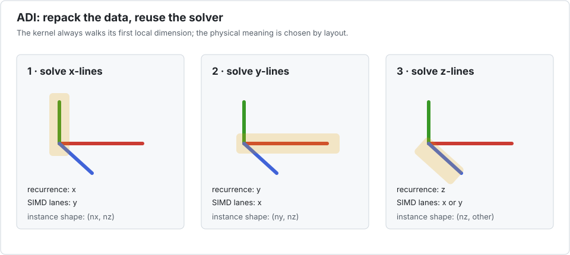

# Tutorial 3 — Repacking a 3-D ADI solver

Alternating-direction implicit schemes solve many independent tridiagonal lines along one
grid direction, then another. The recurrence direction changes, but the line solver does
not have to.



## 1. Separate physical axes from kernel axes

Let the physical grid be `(nx, ny, nz)`. During an x-sweep:

- each recurrence runs along `x`;
- different `y` or `z` lines are independent;
- one independent grid axis can become the Interleave batch dimension.

For example, packing across `y` gives a logical batch of shape `(ny, nx, nz)`:

```@example adi
using Interleave

nx, ny, nz = 32, 20, 12
X = Interleave.Array{Float32,3,8}(undef, ny, nx, nz)
(size(X), instance_size(X), size(parent(X)))
```

The logical indices are `X[y, x, z]`. A kernel instance has shape `(nx, nz)` and elements
of type `Vec{8,Float32}`. It can solve every x-line in that instance with ordinary `(x,z)`
indices.

## 2. Write a line solver, not an axis-specific solver

```@example adi
function thomas_lines!(x, d, u, l, b, scratch)
    n, nlines = size(x)
    @inbounds for line in 1:nlines
        pivot = d[1, line]
        invpivot = inv(pivot)
        x[1, line] = b[1, line] * invpivot
        for i in 2:n
            scratch[i] = u[i - 1, line] * invpivot
            pivot = d[i, line] - l[i, line] * scratch[i]
            x[i, line] = b[i, line] - l[i, line] * x[i - 1, line]
            invpivot = inv(pivot)
            x[i, line] *= invpivot
        end
        for i in n-1:-1:1
            x[i, line] -= scratch[i + 1] * x[i + 1, line]
        end
    end
    x
end
```

The solver only knows that its first local dimension is the recurrence direction. Layout
decides whether that dimension represents physical `x`, `y`, or `z`.

## 3. Prepare one sweep

```@example adi
X, D, U, L, B = (Interleave.Array{Float32,3,8}(undef, ny, nx, nz) for _ in 1:5)
fill!(X, 0); fill!(D, 2); fill!(U, -1); fill!(L, -1); fill!(B, 1)

apply!(thomas_lines!, X, D, U, L, B;
       scratch=Vector{packtype(X)}(undef, nx))
size(X)
```

The scratch buffer has one entry per recurrence position and uses the packed element type.
For parallel execution, pass the same object as a prototype; the driver creates one copy per
chunk.

## 4. Change direction by changing layout

For a y-sweep, construct or transpose into a layout whose instance starts with `ny`. One
possible logical ordering is `(nx, ny, nz)`: `x` supplies lanes, while each kernel instance
has shape `(ny, nz)`.

```julia
Y = Interleave.Array{Float32,3,8}(undef, nx, ny, nz)
```

Production ADI codes commonly transpose between directions for locality anyway. Interleave
makes the purpose explicit: the first logical dimension is the current population of
independent lines, and the first instance dimension is the recurrence direction.

!!! tip "Choose the cheapest independent axis"
    If both remaining grid axes are independent, pack the one that minimizes transposition
    cost and produces enough full packets. The packed axis does not have to be the largest,
    but very small batches waste lanes.

## 5. When repacking is worth it

Repacking is paid once; the recurrence may run for many time steps or nonlinear iterations.
The approach is compelling when the packed layout is reused enough times to amortize data
movement. It is weak when every solve is tiny and a full transpose is required before and
after each call.

Measure the complete stage:

```text
reorder → repeated line solves → reorder back
```

Do not report the line solver alone if the application cannot keep data in the packed
layout.

