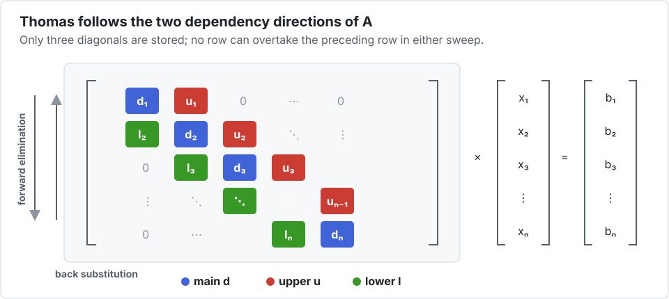

# Tutorial 1 — Vectorizing a tridiagonal solve

This tutorial starts with an algorithm a compiler cannot normally vectorize: the Thomas
solver for a tridiagonal linear system. By the end, the same Julia function will solve one
system with scalar arithmetic or several systems with SIMD arithmetic.

## 1. Find the dependency

For a tridiagonal system ``Ax=b``, forward elimination computes each value from the one just
before it. The backward pass has the same problem in reverse. Reordering either loop changes
the algorithm.



```@example thomas
using Interleave

function thomas!(x, d, u, l, b, scratch)
    @inbounds begin
        pivot = d[1]
        invpivot = inv(pivot)
        x[1] = b[1] * invpivot

        for i in 2:length(x)
            scratch[i] = u[i - 1] * invpivot
            pivot = d[i] - l[i] * scratch[i]
            x[i] = b[i] - l[i] * x[i - 1]
            invpivot = inv(pivot)
            x[i] *= invpivot
        end

        for i in length(x)-1:-1:1
            x[i] -= scratch[i + 1] * x[i + 1]
        end
    end
    x
end
```

This is deliberately ordinary scalar-looking Julia. There are no intrinsics, lane loops,
generated functions, or vector-specific branches. It is also **non-divergent**: every lane
uses the same loop bounds and follows the same control flow. Values differ between systems,
but no packed value decides whether only some lanes enter a branch.

`@inbounds` is not needed to express the algorithm. It is a promise made by the kernel author
after proving the indices valid; that promise is lexical, so `apply!` cannot safely add it
around an arbitrary callback. On the measured Thomas workload, leaving the checks enabled
still emitted SIMD but cost about 30%. A useful workflow is therefore to develop and test
without `@inbounds`, then add it to the proven loop nest.

## 2. Build a scalar oracle

Put the batch in the first dimension. `instance(A, b)` is then the `b`th independent
system.

```@example thomas
function tridiagonal_batch(Arr, nbatch, n)
    x = Arr([0.0f0 for _ in 1:nbatch, _ in 1:n])
    d = Arr([2.0f0 for _ in 1:nbatch, _ in 1:n])
    u = Arr([-1.0f0 for _ in 1:nbatch, _ in 1:n])
    l = Arr([-1.0f0 for _ in 1:nbatch, _ in 1:n])
    b = Arr([sinpi(Float32(job) / 8) + Float32(i) / n
             for job in 1:nbatch, i in 1:n])
    x, d, u, l, b
end

xs, ds, us, ls, bs = tridiagonal_batch(Base.Array{Float32,2}, 61, 32)
apply!(thomas!, xs, ds, us, ls, bs; scratch=similar(instance(xs, 1)))
xs[1, 1:4]
```

`apply!` calls the kernel once per scalar instance. This path is valuable even if you never
use SIMD: it is the simplest oracle for tests and debugging.

The comprehension form works with both aliases. For a packed array it first creates a scalar
matrix and then copies it into DLI storage. That is ideal for examples and setup code. Use
`undef` followed by broadcast or a loop when peak memory or initialization time matters.

## 3. Switch the element type

Now choose packets of eight jobs. Sixty-one is intentionally not divisible by eight; the
last packet therefore exercises padding.

```@example thomas
xv, dv, uv, lv, bv = tridiagonal_batch(Interleave.Array{Float32,2,8}, 61, 32)
apply!(thomas!, xv, dv, uv, lv, bv; scratch=similar(instance(xv, 1)))

(xs == xv, packsize(xv), npacks(xv), npadding(xv))
```

The equality is exact, not approximate. Each lane performs the same floating-point
operations, in the same order, as its scalar instance.

!!! warning "Exactness has a contract"
    Do not use `@fastmath` in a kernel that must match the scalar oracle. If fused
    multiply-add is part of the intended algorithm, write `muladd` explicitly in both paths.

## 4. See why it vectorizes

`instance(xv, 1)` is a dense vector whose element type is `Vec{8,Float32}`:

```@example thomas
packed = instance(xv, 1)
(size(packed), strides(packed), eltype(packed))
```

At index `i`, `x[i]` therefore represents index `i` from eight systems. The recurrence
continues along `i`, but each arithmetic operation advances eight unrelated systems.


The final partial packet contains initialized padding lanes. They are allowed to compute,
but the logical array hides them from indexing, comparison, and reduction.

## 5. Corroborate performance structurally

A shorter runtime is not proof of SIMD: cache effects and instruction-level parallelism can
also help. `code_llvm` asks Julia to show the typed LLVM intermediate representation produced
for one concrete method signature. It does not run the solver and it is not code that belongs
inside the application. Here is a compact Boolean check instead of a screenful of IR:

```julia
using InteractiveUtils

function uses_vector_ir(f, argtypes, P)
    io = IOBuffer()
    code_llvm(io, f, argtypes; debuginfo=:none)
    occursin("<$P x float>", String(take!(io)))
end

uses_vector_ir(thomas!, NTuple{6,Vector{Vec{8,Float32}}}, 8) # true
```

The six argument types are `x`, `d`, `u`, `l`, `b`, and `scratch`. The marker `<8 x float>`
means that the IR contains an eight-lane floating-point value. This is useful corroboration,
not a permanent compiler guarantee: inspect native assembly as well when code generation is
critical, and always pair structure with a runtime measurement.

Then benchmark behind a function barrier. On the measured Apple M-series workload, packet
sizes larger than the 128-bit hardware vector continued to help because several vectors in
flight hide the latency of the dependency chain.


On this run, `P=32` reached 19.38× while `P=16` reached 13.60×, even though one NEON register
holds only four `Float32` values. `P=32` gives LLVM eight native vectors to schedule across
the dependency latency. Going wider is not free: a separate `P=64` inspection showed vector
stack traffic, and the best threaded choice was `P=16`. The [Thomas application
study](../applications/thomas.md) gives the complete
sequential and threaded tables; [Tutorial 4](choosing-p.md) develops a defensible tuning
procedure.

## 6. Check the result with an inverse property

Comparing with an oracle tests the implementation. Checking ``Ax-b`` also tests the problem
being solved:

```@example thomas
function tridiagonal_mul!(r, d, u, l, x)
    n = length(x)
    @inbounds begin
        r[1] = d[1] * x[1] + u[1] * x[2]
        for i in 2:n-1
            r[i] = l[i] * x[i - 1] + d[i] * x[i] + u[i] * x[i + 1]
        end
        r[n] = l[n] * x[n - 1] + d[n] * x[n]
    end
    r
end

r = Interleave.Array{Float32,2,8}(undef, 61, 32)
fill!(r, 0)
apply!(tridiagonal_mul!, r, dv, uv, lv, xv)
maximum(abs(r[job, i] - bv[job, i]) for job in 1:61, i in 1:32) < 1f-4
```

You now have the core Interleave workflow: validate on `Base.Array`, change only the batch
type, demand exact lane-wise agreement, inspect LLVM, and measure several packet sizes.
